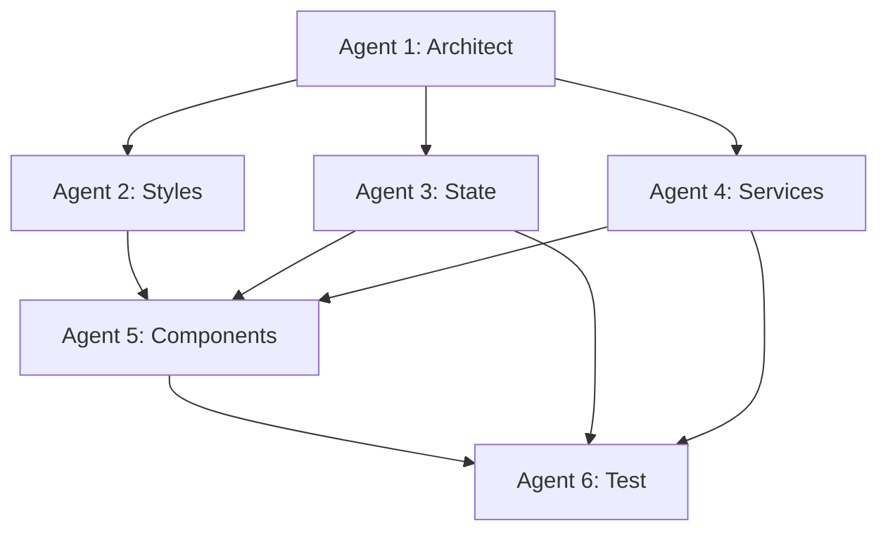

# 🤖 Stock Desk - Agent Teams 협업 가이드

> Claude Agent Teams를 활용한 체계적인 프로젝트 개발 전략

## 📋 전체 구조



## 🎯 에이전트 역할

| Agent             | 역할            | 주요 작업                       | 의존성                  |
| ----------------- | --------------- | ------------------------------- | ----------------------- |
| **1. Architect**  | 프로젝트 설계자 | 폴더 구조, 설정 파일, 타입 정의 | 없음 (시작점)           |
| **2. Styles**     | 스타일 전문가   | Tailwind, CSS, 디자인 시스템    | Architect               |
| **3. State**      | 상태 관리       | Zustand 스토어, 전역 상태       | Architect               |
| **4. Services**   | 서비스 레이어   | API, WebSocket, Storage         | Architect               |
| **5. Components** | UI 개발자       | React 컴포넌트, Atomic Design   | Styles, State, Services |
| **6. Test**       | 테스트 전문가   | Vitest, Storybook, TDD          | 모든 단계               |

## 🔄 작업 흐름

### Phase 1: 기반 구축 (병렬 불가)

```
1️⃣ Architect (필수 선행)
   ↓
2️⃣ Styles (Architect 완료 후)
```

### Phase 2: 핵심 로직 (병렬 가능)

```
3️⃣ State    ←→   4️⃣ Services
   (독립적으로 작업 가능)
```

### Phase 3: UI 구축

```
5️⃣ Components (State + Services 완료 후)
   ↓
6️⃣ Test (각 단계마다 병렬 작업)
```

## 📂 결과물 구조

```
stock-desk/
├── src/
│   ├── components/        # Agent 5: Components
│   │   ├── atoms/
│   │   ├── molecules/
│   │   ├── organisms/
│   │   ├── templates/
│   │   └── pages/
│   ├── hooks/             # Agent 5: Components
│   ├── stores/            # Agent 3: State
│   ├── services/          # Agent 4: Services
│   │   ├── api/
│   │   ├── websocket/
│   │   └── storage/
│   ├── utils/             # Agent 2: Styles + Agent 4: Services
│   ├── types/             # Agent 1: Architect
│   ├── constants/         # Agent 1: Architect
│   └── styles/            # Agent 2: Styles
├── tests/                 # Agent 6: Test
├── .storybook/            # Agent 6: Test
└── config files           # Agent 1: Architect
```

## 🤝 에이전트 간 인터페이스

### Architect → 다른 모든 에이전트

```typescript
// 제공: 타입 정의
interface StockBox {
  id: string;
  symbol: string;
  position: { x: number; y: number };
  size: { width: number; height: number };
}

// 제공: 경로 별칭
// @/components, @/hooks, @/stores, @/services, @/utils
```

### State → Components

```typescript
// 제공: Zustand 훅
export const useStockStore = () => {
  const stocks = useStore((state) => state.stocks);
  const addStock = useStore((state) => state.addStock);
  return { stocks, addStock };
};
```

### Services → Components

```typescript
// 제공: API 함수
export const stockService = {
  getPrice: (symbol: string) => Promise<StockPrice>,
  subscribe: (symbol: string, callback: (data) => void) => void
};
```

### Styles → Components

```typescript
// 제공: 유틸리티
export function cn(...inputs: ClassValue[]): string;

// 제공: 테마
// Tailwind 클래스: glass, card-gradient 등
```

## ✅ 전체 진행 체크리스트

### Phase 1: 기반 구축

- [ ] **Architect**: 프로젝트 구조 완료
- [ ] **Architect**: 타입 정의 완료
- [ ] **Styles**: Tailwind 설정 완료
- [ ] **Styles**: 글로벌 스타일 완료

### Phase 2: 핵심 로직

- [ ] **State**: Zustand 스토어 구조 완료
- [ ] **Services**: API 레이어 완료
- [ ] **Services**: WebSocket 연결 완료
- [ ] **Services**: LocalStorage 유틸 완료

### Phase 3: UI 개발

- [ ] **Components**: Atoms 완료
- [ ] **Components**: Molecules 완료
- [ ] **Components**: Organisms 완료
- [ ] **Components**: Templates 완료
- [ ] **Components**: Pages 완료
- [ ] **Test**: 각 컴포넌트 테스트 완료
- [ ] **Test**: Storybook 스토리 완료

## 🔒 협업 규칙

### 1. 파일 충돌 방지

- 각 에이전트는 자신의 담당 폴더만 작업
- 공유 타입은 Architect가 `types/` 폴더에 정의
- 다른 에이전트 파일 수정 금지

### 2. 타입 안정성

- 모든 인터페이스는 타입으로 정의
- `any` 사용 금지
- 에이전트 간 데이터는 타입으로 계약

### 3. 코드 스타일

- Prettier, ESLint 설정 준수 (Architect가 설정)
- 네이밍 컨벤션:
  - 컴포넌트: PascalCase
  - 함수/변수: camelCase
  - 상수: UPPER_SNAKE_CASE
  - 파일: kebab-case (컴포넌트 제외)

### 4. 커밋 규칙

```
[Agent 이름] 작업 내용

예시:
[Architect] Add project structure and type definitions
[Styles] Setup Tailwind with glassmorphism utilities
[State] Implement Zustand store with persist
```

## 📚 필수 읽기 문서 (모든 에이전트)

1. **CLAUDE.md** - 프로젝트 전체 이해
2. **PROJECT_REQUIREMENTS.md** - 요구사항 상세
3. **해당 에이전트 가이드** - 자신의 역할 전용 문서

## 🚀 시작 방법

### 1단계: Architect 에이전트 시작

```bash
# 에이전트에게 전달할 메시지
"AGENT_ARCHITECT.md 파일을 읽고 작업을 시작해주세요"
```

### 2단계: 다른 에이전트들 순차 실행

- Architect 완료 후 → Styles
- Styles 완료 후 → State, Services (병렬 가능)
- State + Services 완료 후 → Components
- 각 단계마다 Test 에이전트가 병렬로 작업

## ⚠️ 주의사항

1. **의존성 준수**: 선행 에이전트 작업 완료 전 시작 금지
2. **인터페이스 변경 금지**: 다른 에이전트가 사용 중인 인터페이스 함부로 변경 금지
3. **범위 준수**: 자신의 역할 범위만 작업
4. **문서화**: 주요 변경사항은 해당 에이전트 가이드에 기록

---

**작성일**: 2026-02-15  
**버전**: 1.0.0
