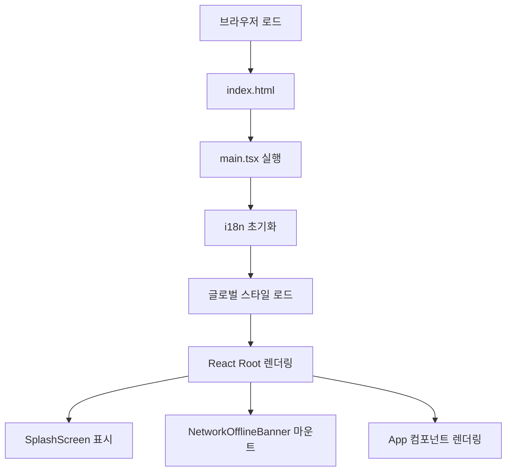
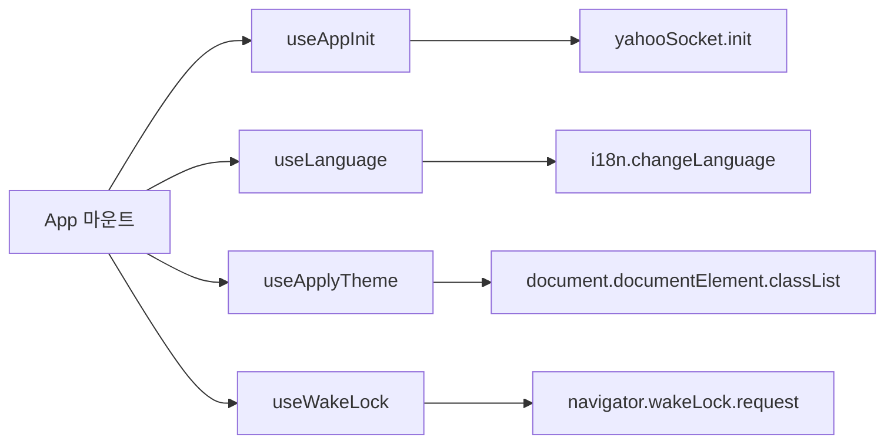
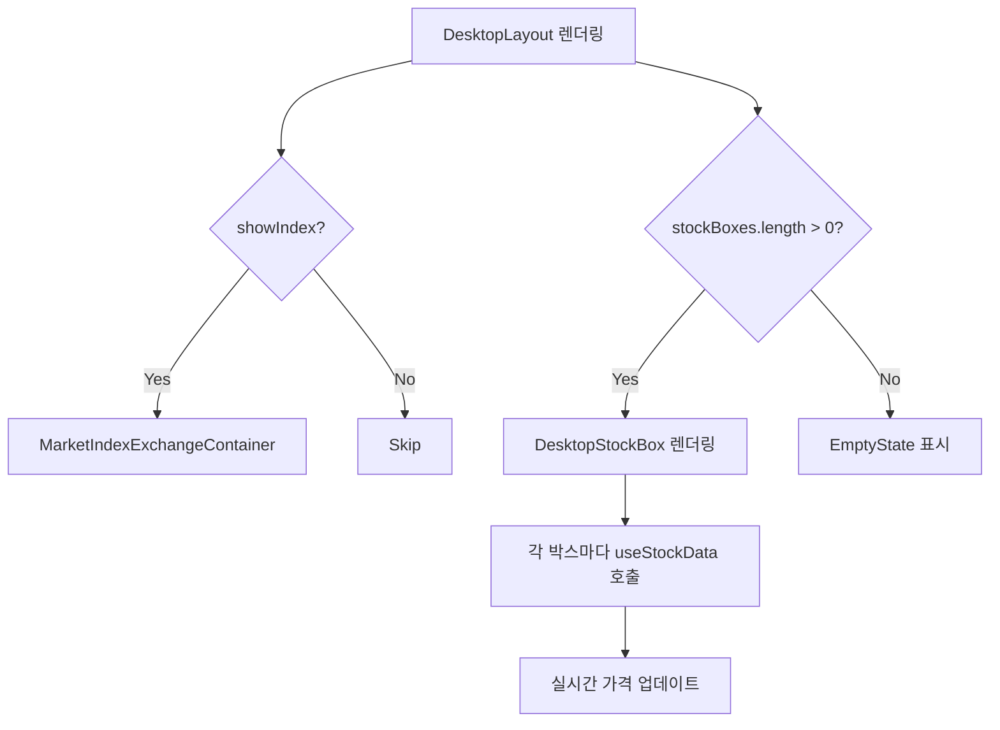
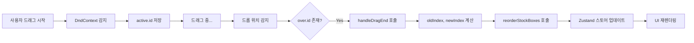
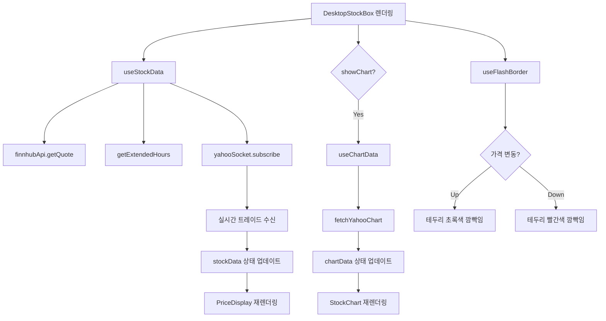
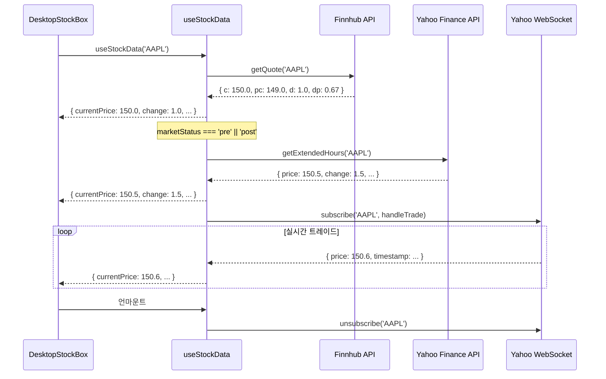
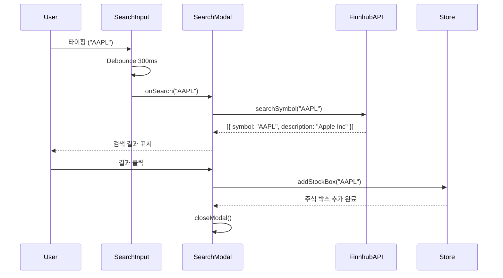

# Stock Desk - 애플리케이션 흐름 상세 가이드

> 이 문서는 Stock Desk 애플리케이션의 전체 흐름을 페이지별, 컴포넌트별, Hook별로 상세하게 설명합니다.
> **목적**: 신규 개발자가 코드베이스를 빠르게 이해하고, 유지보수 및 기능 추가를 쉽게 할 수 있도록 돕습니다.

---

## 📚 목차

1. [애플리케이션 개요](#1-애플리케이션-개요)
2. [진입점 및 초기화](#2-진입점-및-초기화)
3. [메인 애플리케이션 (App.tsx)](#3-메인-애플리케이션-apptsx)
4. [데스크톱 레이아웃](#4-데스크톱-레이아웃)
5. [모바일 레이아웃](#5-모바일-레이아웃)
6. [주식 박스 (StockBox)](#6-주식-박스-stockbox)
7. [실시간 데이터 흐름](#7-실시간-데이터-흐름)
8. [차트 데이터 흐름](#8-차트-데이터-흐름)
9. [검색 모달](#9-검색-모달)
10. [설정 모달](#10-설정-모달)
11. [시장 지수 및 환율](#11-시장-지수-및-환율)
12. [상태 관리 (Zustand Stores)](#12-상태-관리-zustand-stores)
13. [API 및 서비스 레이어](#13-api-및-서비스-레이어)
14. [에러 처리 및 오프라인 대응](#14-에러-처리-및-오프라인-대응)
15. [애니메이션 및 UX](#15-애니메이션-및-ux)
16. [다국어 (i18n)](#16-다국어-i18n)
17. [테마 시스템](#17-테마-시스템)
18. [성능 최적화](#18-성능-최적화)

---

## 1. 애플리케이션 개요

### 1.1 프로젝트 구조

Stock Desk는 **단일 페이지 애플리케이션 (SPA)**입니다. 페이지 라우팅 없이 하나의 화면에서 모든 기능을 제공합니다.

**핵심 특징**:

- ✅ 실시간 주식 가격 모니터링 (Yahoo Finance WebSocket)
- ✅ 확장시간 거래 지원 (프리마켓, 애프터마켓)
- ✅ 드래그 & 리사이징 (Desktop), 순서 변경 (Mobile)
- ✅ 실시간 차트 (Lightweight Charts)
- ✅ 다국어 (한국어/English)
- ✅ 다크/라이트 모드
- ✅ USD/KRW 환율 변환
- ✅ 오프라인 감지 및 알림
- ✅ PWA (Progressive Web App)

### 1.2 기술 스택 (핵심만)

| 레이어              | 기술                        | 용도                            |
| ------------------- | --------------------------- | ------------------------------- |
| **UI**              | React 18 + TypeScript       | 컴포넌트 기반 UI                |
| **상태 관리**       | Zustand                     | 전역 상태 (주식 박스, 설정, UI) |
| **스타일**          | Tailwind CSS + CSS Modules  | 유틸리티 우선 + Glassmorphism   |
| **차트**            | Lightweight Charts          | TradingView 기반 경량 차트      |
| **드래그/리사이즈** | react-rnd, @dnd-kit         | Desktop/Mobile DnD              |
| **실시간 데이터**   | Yahoo Finance WebSocket     | Protobuf 기반 실시간 트레이드   |
| **API 프록시**      | Vercel Serverless Functions | CORS 회피 + API 키 보안         |
| **다국어**          | react-i18next               | 한국어/English 지원             |
| **빌드**            | Vite                        | 빠른 빌드 및 HMR                |

### 1.3 디렉토리 구조 (간략화)

```
src/
├── main.tsx                    # React 진입점
├── App.tsx                     # 메인 애플리케이션
├── components/                 # 기본 UI 컴포넌트
│   ├── header/                 # 상단 헤더
│   ├── desktop-layout/         # 데스크톱 레이아웃
│   ├── mobile-layout/          # 모바일 레이아웃
│   ├── modal/                  # 모달 컨테이너
│   ├── toast/                  # 토스트 알림
│   └── ...
├── features/                   # 도메인 특화 컴포넌트
│   ├── desktop-stock-box/      # 데스크톱 주식 박스
│   ├── mobile-stock-box/       # 모바일 주식 카드
│   ├── search-modal/           # 종목 검색 모달
│   ├── settings-modal/         # 설정 모달
│   ├── stock-chart/            # 차트
│   ├── price-display/          # 가격 표시
│   └── ...
├── hooks/                      # Custom Hooks (비즈니스 로직)
│   ├── use-stock-data.ts       # 실시간 주식 데이터
│   ├── use-chart-data.ts       # 차트 데이터
│   ├── use-market-status.ts    # 시장 개장 상태
│   └── ...
├── stores/                     # Zustand 스토어
│   ├── stock-box-store.ts      # 주식 박스 목록/위치/크기
│   ├── settings-store.ts       # 설정 (테마, 언어, 통화 등)
│   ├── ui-store.ts             # UI 상태 (모달 열림)
│   └── toast-store.ts          # 토스트 메시지
├── services/                   # API 및 WebSocket
│   ├── api/                    # REST API 호출
│   └── websocket/              # WebSocket 연결
├── types/                      # TypeScript 타입
├── constants/                  # 상수
└── utils/                      # 유틸리티 함수
```

---

## 2. 진입점 및 초기화

### 2.1 main.tsx (React Root)

**파일**: [`src/main.tsx`](../../src/main.tsx)

```tsx
// 2. i18n 초기화
import "./i18n";
// 3. 글로벌 스타일 import
import "./styles/globals.css";
import "./styles/themes.css";

// 1. React Root 생성
const root = ReactDOM.createRoot(document.getElementById("root")!);

// 4. 렌더링
root.render(
  <React.StrictMode>
    <SplashScreen /> {/* 로딩 화면 */}
    <NetworkOfflineBanner /> {/* 오프라인 알림 */}
    <App /> {/* 메인 애플리케이션 */}
  </React.StrictMode>
);
```

#### 실행 흐름



#### 주요 컴포넌트

| 컴포넌트                 | 역할                        | 표시 조건                               |
| ------------------------ | --------------------------- | --------------------------------------- |
| **SplashScreen**         | 로딩 화면 (GSAP 애니메이션) | 초기 로드 시 2초간 표시 후 페이드아웃   |
| **NetworkOfflineBanner** | 오프라인 알림 배너          | `navigator.onLine === false` 일 때 표시 |
| **App**                  | 메인 애플리케이션           | 항상 표시                               |

---

### 2.2 i18n 초기화

**파일**: [`src/i18n/index.ts`](../../src/i18n/index.ts)

```typescript
import i18n from "i18next";
import LanguageDetector from "i18next-browser-languagedetector";
import { initReactI18next } from "react-i18next";

i18n
  .use(LanguageDetector) // 브라우저 언어 자동 감지
  .use(initReactI18next) // React 통합
  .init({
    resources: {
      ko: { translation: koTranslation },
      en: { translation: enTranslation },
    },
    fallbackLng: "ko", // 기본 언어
    interpolation: {
      escapeValue: false, // React에서 XSS 방지 자동 처리
    },
  });
```

#### 지원 언어

- **한국어 (ko)**: [`src/i18n/locales/ko.json`](../../src/i18n/locales/ko.json)
- **English (en)**: [`src/i18n/locales/en.json`](../../src/i18n/locales/en.json)

#### 사용 예시

```tsx
import { useTranslation } from "react-i18next";

const { t, i18n } = useTranslation();

// 번역
<h1>{t("header.exchangeRate")}</h1>;

// 언어 변경
i18n.changeLanguage("en");
```

---

## 3. 메인 애플리케이션 (App.tsx)

**파일**: [`src/App.tsx`](../../src/App.tsx)

### 3.1 전체 구조

```tsx
function App() {
  // 1. 초기화 훅
  useAppInit(); // WebSocket 초기화
  useLanguage(); // i18n 언어 설정
  useApplyTheme(); // 테마 적용
  useWakeLock(); // 화면 켜짐 유지

  // 2. 모바일/데스크톱 판별
  const isMobile = useIsMobile();

  return (
    <>
      {/* 헤더 */}
      <Header />

      {/* 레이아웃 분기 */}
      {isMobile ? <MobileLayout /> : <DesktopLayout />}

      {/* 전역 모달 */}
      <SearchModal />
      <SettingsModal />

      {/* 토스트 알림 */}
      <ToastContainer />
    </>
  );
}
```

### 3.2 초기화 Hook 실행 흐름



#### useAppInit()

**파일**: [`src/hooks/use-app-init.ts`](../../src/hooks/use-app-init.ts)

```typescript
export const useAppInit = () => {
  useEffect(() => {
    // Yahoo Finance WebSocket 초기화
    yahooSocket.init();

    return () => {
      // 클린업: WebSocket 연결 해제
      yahooSocket.close();
    };
  }, []);
};
```

**역할**:

- Yahoo Finance WebSocket 연결 초기화
- 앱 종료 시 WebSocket 자동 종료

#### useLanguage()

**파일**: [`src/hooks/use-language.ts`](../../src/hooks/use-language.ts)

```typescript
export const useLanguage = () => {
  const language = useSettingsStore((state) => state.language);
  const { i18n } = useTranslation();

  useEffect(() => {
    i18n.changeLanguage(language);
  }, [language, i18n]);
};
```

**역할**:

- Zustand 스토어의 `language` 설정을 i18n에 동기화
- 언어 변경 시 자동으로 UI 업데이트

#### useApplyTheme()

**파일**: [`src/hooks/use-apply-theme.ts`](../../src/hooks/use-apply-theme.ts)

```typescript
export const useApplyTheme = () => {
  const theme = useSettingsStore((state) => state.theme);

  useEffect(() => {
    const root = document.documentElement;

    if (theme === "dark") {
      root.classList.add("dark");
    } else {
      root.classList.remove("dark");
    }
  }, [theme]);
};
```

**역할**:

- 테마 설정에 따라 `<html>` 요소에 `dark` 클래스 추가/제거
- Tailwind CSS의 `dark:` 변형이 자동으로 적용됨

#### useWakeLock()

**파일**: [`src/hooks/use-wake-lock.ts`](../../src/hooks/use-wake-lock.ts)

```typescript
export const useWakeLock = () => {
  useEffect(() => {
    let wakeLock: WakeLockSentinel | null = null;

    const requestWakeLock = async () => {
      if ("wakeLock" in navigator) {
        wakeLock = await navigator.wakeLock.request("screen");
      }
    };

    requestWakeLock();

    return () => {
      wakeLock?.release();
    };
  }, []);
};
```

**역할**:

- 화면 켜짐 유지 (자동 꺼짐 방지)
- 실시간 모니터링 용도로 유용

### 3.3 모바일/데스크톱 판별

#### useIsMobile()

**파일**: [`src/hooks/use-is-mobile.ts`](../../src/hooks/use-is-mobile.ts)

```typescript
export const useIsMobile = () => {
  const [isMobile, setIsMobile] = useState(false);

  useEffect(() => {
    const mediaQuery = window.matchMedia("(max-width: 768px)");
    setIsMobile(mediaQuery.matches);

    const handler = (e: MediaQueryListEvent) => setIsMobile(e.matches);
    mediaQuery.addEventListener("change", handler);

    return () => mediaQuery.removeEventListener("change", handler);
  }, []);

  return isMobile;
};
```

**역할**:

- 화면 너비 768px 이하면 모바일로 판단
- 반응형 레이아웃 분기에 사용

---

## 4. 데스크톱 레이아웃

**파일**: [`src/components/desktop-layout/DesktopLayout.tsx`](../../src/components/desktop-layout/DesktopLayout.tsx)

### 4.1 컴포넌트 구조

```tsx
export const DesktopLayout = () => {
  const stockBoxes = useStockBoxStore((state) => state.stockBoxes);
  const showChart = useSettingsStore((state) => state.showChart);
  const showIndex = useSettingsStore((state) => state.showIndex);

  return (
    <div className="relative h-screen w-screen overflow-hidden">
      {/* 시장 지수 + 환율 */}
      {showIndex && <MarketIndexExchangeContainer />}

      {/* 주식 박스들 */}
      {stockBoxes.map((box) => (
        <DesktopStockBox key={box.id} stockBox={box} showChart={showChart} />
      ))}

      {/* 빈 상태 */}
      {stockBoxes.length === 0 && <EmptyState />}
    </div>
  );
};
```

### 4.2 렌더링 흐름



### 4.3 주요 컴포넌트

#### MarketIndexExchangeContainer

**파일**: [`src/features/market-index-bar/MarketIndexExchangeContainer.tsx`](../../src/features/market-index-bar/MarketIndexExchangeContainer.tsx)

**역할**:

- 시장 지수 3개 (^DJI, ^GSPC, ^IXIC) 표시
- USD/KRW 환율 표시
- 데스크톱용 박스 레이아웃

**구성**:

```tsx
<div className="flex gap-2">
  <DesktopIndexBox symbol="^DJI" />
  <DesktopIndexBox symbol="^GSPC" />
  <DesktopIndexBox symbol="^IXIC" />
  <DesktopExchangeRateBox />
</div>
```

#### DesktopStockBox

**파일**: [`src/features/desktop-stock-box/DesktopStockBox.tsx`](../../src/features/desktop-stock-box/DesktopStockBox.tsx)

**역할**:

- 주식 박스 렌더링 (드래그 & 리사이징 가능)
- 실시간 가격 표시
- 차트 표시 (showChart === true 시)
- Z-index 관리 (클릭 시 최상위로)

**상세 내용**: [6. 주식 박스 (StockBox)](#6-주식-박스-stockbox) 참조

#### EmptyState

**파일**: [`src/components/empty-state/EmptyState.tsx`](../../src/components/empty-state/EmptyState.tsx)

**역할**:

- 주식 박스가 없을 때 표시
- "검색하여 종목 추가" 안내 메시지

---

## 5. 모바일 레이아웃

**파일**: [`src/components/mobile-layout/MobileLayout.tsx`](../../src/components/mobile-layout/MobileLayout.tsx)

### 5.1 컴포넌트 구조

```tsx
export const MobileLayout = () => {
  const stockBoxes = useStockBoxStore((state) => state.stockBoxes);
  const reorderStockBoxes = useStockBoxStore((state) => state.reorderStockBoxes);
  const showIndex = useSettingsStore((state) => state.showIndex);

  // DnD Kit
  const sensors = useSensors(
    useSensor(PointerSensor),
    useSensor(KeyboardSensor, { coordinateGetter: sortableKeyboardCoordinates })
  );

  const handleDragEnd = (event: DragEndEvent) => {
    const { active, over } = event;
    if (over && active.id !== over.id) {
      const oldIndex = stockBoxes.findIndex((box) => box.id === active.id);
      const newIndex = stockBoxes.findIndex((box) => box.id === over.id);
      reorderStockBoxes(oldIndex, newIndex);
    }
  };

  return (
    <div className="overflow-y-auto p-4">
      {/* 시장 지수 + 환율 */}
      {showIndex && <MarketIndexExchangeContainer />}

      {/* DnD 컨테이너 */}
      <DndContext sensors={sensors} onDragEnd={handleDragEnd}>
        <SortableContext items={stockBoxes.map((box) => box.id)}>
          {stockBoxes.map((box) => (
            <MobileStockBox key={box.id} stockBox={box} />
          ))}
        </SortableContext>
      </DndContext>

      {/* 빈 상태 */}
      {stockBoxes.length === 0 && <EmptyState />}
    </div>
  );
};
```

### 5.2 DnD Kit (드래그 앤 드롭)

**라이브러리**: `@dnd-kit/core`, `@dnd-kit/sortable`

#### 동작 흐름



#### reorderStockBoxes()

**파일**: [`src/stores/stock-box-store.ts`](../../src/stores/stock-box-store.ts)

```typescript
reorderStockBoxes: (oldIndex, newIndex) => {
  set((state) => {
    const newBoxes = [...state.stockBoxes];
    const [movedBox] = newBoxes.splice(oldIndex, 1);
    newBoxes.splice(newIndex, 0, movedBox);
    state.stockBoxes = newBoxes;
  });
},
```

**역할**:

- 배열에서 요소를 제거(`splice(oldIndex, 1)`)한 후
- 새 위치에 삽입(`splice(newIndex, 0, movedBox)`)
- Immer를 통해 불변성 자동 유지

### 5.3 모바일 컴포넌트

#### MobileStockBox

**파일**: [`src/features/mobile-stock-box/MobileStockBox.tsx`](../../src/features/mobile-stock-box/MobileStockBox.tsx)

**역할**:

- 카드 형태 주식 박스
- 좌우 스와이프로 삭제 (선택사항)
- 실시간 가격 표시

**데스크톱과의 차이**:

- ❌ 드래그 & 리사이징 없음 (카드 고정 크기)
- ✅ 수직 스크롤 가능
- ✅ @dnd-kit으로 순서 변경

---

## 6. 주식 박스 (StockBox)

### 6.1 DesktopStockBox 상세

**파일**: [`src/features/desktop-stock-box/DesktopStockBox.tsx`](../../src/features/desktop-stock-box/DesktopStockBox.tsx)

#### 6.1.1 Props

```typescript
interface DesktopStockBoxProps {
  stockBox: StockBox; // { id, symbol, position, size, zIndex }
  showChart: boolean; // 차트 표시 여부
}
```

#### 6.1.2 컴포넌트 구조

```tsx
export const DesktopStockBox = ({ stockBox, showChart }: DesktopStockBoxProps) => {
  const { id, symbol, position, size, zIndex } = stockBox;

  // 1. 실시간 데이터 가져오기
  const { data: stockData, loading, error } = useStockData(symbol);

  // 2. 차트 데이터 가져오기 (showChart === true 시에만)
  const [chartRange, setChartRange] = useState<ChartTimeRange>("1D");
  const { data: chartData, loading: chartLoading } = useChartData(symbol, chartRange, showChart);

  // 3. 가격 변동 시 테두리 깜빡임
  const flashBorderClass = useFlashBorder(stockData?.currentPrice);

  // 4. Zustand 스토어 액션
  const updatePosition = useStockBoxStore((state) => state.updatePosition);
  const updateSize = useStockBoxStore((state) => state.updateSize);
  const bringToFront = useStockBoxStore((state) => state.bringToFront);
  const removeStockBox = useStockBoxStore((state) => state.removeStockBox);

  // 5. 이벤트 핸들러
  const handleDragStop = (_e: DraggableEvent, data: DraggableData) => {
    updatePosition(id, { x: data.x, y: data.y });
  };

  const handleResizeStop = (
    _e: MouseEvent | TouchEvent,
    _direction: Direction,
    ref: HTMLElement,
    _delta: ResizableDelta,
    position: Position
  ) => {
    updateSize(id, {
      width: ref.offsetWidth,
      height: ref.offsetHeight,
    });
    updatePosition(id, position);
  };

  const handleClick = () => {
    bringToFront(id);
  };

  const handleClose = () => {
    removeStockBox(id);
  };

  // 6. 렌더링
  return (
    <Rnd
      position={position}
      size={size}
      onDragStop={handleDragStop}
      onResizeStop={handleResizeStop}
      onClick={handleClick}
      style={{ zIndex }}
      className={cn(
        "glass rounded-xl p-4 shadow-xl transition-shadow",
        flashBorderClass,
        "hover:shadow-2xl"
      )}
    >
      {/* 헤더: 심볼, 종료 버튼 */}
      <div className="flex items-center justify-between">
        <h3 className="text-lg font-bold">{symbol}</h3>
        <button onClick={handleClose}>✕</button>
      </div>

      {/* 가격 표시 */}
      {loading && <div>Loading...</div>}
      {error && <div>Error: {error}</div>}
      {stockData && <PriceDisplay stockData={stockData} symbol={symbol} />}

      {/* 차트 */}
      {showChart && (
        <Suspense fallback={<div>Loading chart...</div>}>
          <StockChart
            data={chartData}
            loading={chartLoading}
            range={chartRange}
            onRangeChange={setChartRange}
          />
        </Suspense>
      )}
    </Rnd>
  );
};
```

#### 6.1.3 react-rnd 속성

| 속성             | 역할                          |
| ---------------- | ----------------------------- |
| **position**     | 박스 위치 `{ x, y }`          |
| **size**         | 박스 크기 `{ width, height }` |
| **onDragStop**   | 드래그 종료 시 위치 저장      |
| **onResizeStop** | 리사이징 종료 시 크기 저장    |
| **style.zIndex** | Z-index 설정 (클릭 시 최상위) |

#### 6.1.4 주요 Hook 흐름



---

### 6.2 PriceDisplay 상세

**파일**: [`src/features/price-display/PriceDisplay.tsx`](../../src/features/price-display/PriceDisplay.tsx)

#### 6.2.1 Props

```typescript
interface PriceDisplayProps {
  stockData: StockPrice;
  symbol: string;
}

interface StockPrice {
  currentPrice: number;
  previousClose: number;
  change: number;
  changePercent: number;
  marketStatus: MarketStatus; // 'open' | 'pre' | 'post' | 'closed'
  timestamp?: number;
}
```

#### 6.2.2 컴포넌트 구조

```tsx
export const PriceDisplay = ({ stockData, symbol }: PriceDisplayProps) => {
  const { currentPrice, previousClose, change, changePercent, marketStatus } = stockData;

  // 1. 설정 가져오기
  const currency = useSettingsStore((state) => state.currency);
  const isKoreanColor = useSettingsStore((state) => state.isKoreanColor);

  // 2. 환율 가져오기 (currency === 'KRW' 시에만)
  const { rate: exchangeRate } = useExchangeRate(currency === "KRW");

  // 3. 가격 포맷팅
  const formattedPrice =
    currency === "KRW" ? formatKRW(currentPrice * exchangeRate) : formatUSD(currentPrice);

  const formattedChange =
    currency === "KRW" ? formatChangeKRW(change * exchangeRate) : formatChangeUSD(change);

  const formattedPercent = formatPercent(changePercent);

  // 4. 색상 결정 (한국식 vs 미국식)
  const isPositive = change > 0;
  const colorClass = isKoreanColor
    ? isPositive
      ? "text-up-kr"
      : "text-down-kr" // 한국: 빨강(상승), 파랑(하락)
    : isPositive
      ? "text-green-500"
      : "text-red-500"; // 미국: 초록(상승), 빨강(하락)

  // 5. 시장 상태 배지
  const marketStatusBadge = (
    <Badge variant={marketStatus}>
      {marketStatus === "pre" && "PRE"}
      {marketStatus === "post" && "POST"}
      {marketStatus === "open" && "OPEN"}
      {marketStatus === "closed" && "CLOSED"}
    </Badge>
  );

  return (
    <div className="space-y-2">
      {/* 현재 가격 */}
      <div className="text-3xl font-bold">{formattedPrice}</div>

      {/* 변동 금액 및 퍼센트 */}
      <div className={cn("text-xl", colorClass)}>
        {formattedChange} ({formattedPercent})
      </div>

      {/* 시장 상태 */}
      {marketStatusBadge}

      {/* 이전 종가 */}
      <div className="text-sm text-gray-500">
        {t("stockBox.previousClose")}: {formatUSD(previousClose)}
      </div>
    </div>
  );
};
```

#### 6.2.3 색상 표시 로직

| 설정                                | 상승                    | 하락                  |
| ----------------------------------- | ----------------------- | --------------------- |
| **한국식** (`isKoreanColor: true`)  | 빨강 (`#ff0000`)        | 파랑 (`#0000ff`)      |
| **미국식** (`isKoreanColor: false`) | 초록 (`text-green-500`) | 빨강 (`text-red-500`) |

---

### 6.3 StockChart 상세

**파일**: [`src/features/stock-chart/StockChart.tsx`](../../src/features/stock-chart/StockChart.tsx)

#### 6.3.1 Lazy Loading

```tsx
// App.tsx 또는 DesktopStockBox.tsx
const StockChart = lazy(() => import("@/features/stock-chart"));

<Suspense fallback={<div>Loading chart...</div>}>
  <StockChart
    data={chartData}
    loading={chartLoading}
    range={chartRange}
    onRangeChange={setChartRange}
  />
</Suspense>;
```

**이유**: Lightweight Charts 라이브러리가 크기 때문에 필요할 때만 로드

#### 6.3.2 Props

```typescript
interface StockChartProps {
  data: StockChartData[];
  loading: boolean;
  range: ChartTimeRange; // '1D' | '1W' | '1M' | '3M' | '1Y'
  onRangeChange: (range: ChartTimeRange) => void;
}

interface StockChartData {
  time: string; // YYYY-MM-DD 또는 Unix timestamp
  open: number;
  high: number;
  low: number;
  close: number;
  volume?: number;
}
```

#### 6.3.3 컴포넌트 구조

```tsx
export const StockChart = ({ data, loading, range, onRangeChange }: StockChartProps) => {
  const chartContainerRef = useRef<HTMLDivElement>(null);
  const chartRef = useRef<IChartApi | null>(null);

  // 1. 테마 가져오기
  const theme = useSettingsStore((state) => state.theme);

  // 2. 차트 초기화
  useEffect(() => {
    if (!chartContainerRef.current) return;

    const chart = createChart(chartContainerRef.current, {
      width: chartContainerRef.current.clientWidth,
      height: 300,
      layout: {
        background: { color: theme === "dark" ? "#1a1a1a" : "#ffffff" },
        textColor: theme === "dark" ? "#d1d5db" : "#1f2937",
      },
      grid: {
        vertLines: { color: theme === "dark" ? "#374151" : "#e5e7eb" },
        horzLines: { color: theme === "dark" ? "#374151" : "#e5e7eb" },
      },
    });

    chartRef.current = chart;

    return () => {
      chart.remove();
    };
  }, [theme]);

  // 3. 데이터 업데이트
  useEffect(() => {
    if (!chartRef.current || !data || data.length === 0) return;

    const candlestickSeries = chartRef.current.addCandlestickSeries();
    candlestickSeries.setData(data);

    chartRef.current.timeScale().fitContent();
  }, [data]);

  return (
    <div className="mt-4">
      {/* 기간 선택 버튼 */}
      <div className="mb-2 flex gap-2">
        {["1D", "1W", "1M", "3M", "1Y"].map((r) => (
          <button
            key={r}
            onClick={() => onRangeChange(r as ChartTimeRange)}
            className={cn(
              "rounded px-3 py-1 text-sm",
              r === range ? "bg-blue-500 text-white" : "bg-gray-200 dark:bg-gray-700"
            )}
          >
            {r}
          </button>
        ))}
      </div>

      {/* 차트 컨테이너 */}
      {loading && <div>Loading chart...</div>}
      <div ref={chartContainerRef} className="h-[300px] w-full" />
    </div>
  );
};
```

#### 6.3.4 Lightweight Charts 옵션

| 옵션                         | 설명                      |
| ---------------------------- | ------------------------- |
| **layout.background**        | 배경색 (다크/라이트 모드) |
| **layout.textColor**         | 텍스트 색상               |
| **grid.vertLines**           | 수직 그리드 색상          |
| **grid.horzLines**           | 수평 그리드 색상          |
| **addCandlestickSeries()**   | 캔들스틱 차트 추가        |
| **timeScale().fitContent()** | 타임스케일 자동 맞춤      |

---

## 7. 실시간 데이터 흐름

### 7.1 useStockData Hook

**파일**: [`src/hooks/use-stock-data.ts`](../../src/hooks/use-stock-data.ts)

#### 7.1.1 전체 코드 구조

```typescript
export const useStockData = (symbol: string) => {
  const [data, setData] = useState<StockPrice | null>(null);
  const [loading, setLoading] = useState(true);
  const [error, setError] = useState<string | null>(null);

  // 시장 상태
  const marketStatus = useMarketStatus();

  useEffect(() => {
    let isMounted = true;

    // 1. 초기 데이터 로드 (Finnhub)
    const fetchInitialData = async () => {
      try {
        const quote = await finnhubApi.getQuote(symbol);
        if (!isMounted) return;

        setData({
          currentPrice: quote.c, // 현재가
          previousClose: quote.pc, // 이전 종가
          change: quote.d, // 변동 금액
          changePercent: quote.dp, // 변동 퍼센트
          marketStatus,
        });
        setLoading(false);
      } catch (err) {
        setError(err.message);
        setLoading(false);
      }
    };

    // 2. 확장시간 데이터 로드 (프리/애프터마켓)
    const fetchExtendedHoursData = async () => {
      if (marketStatus === "open" || marketStatus === "closed") return;

      try {
        const extendedData = await getExtendedHours(symbol);
        if (!isMounted) return;

        setData((prev) => ({
          ...prev!,
          currentPrice: extendedData.price,
          change: extendedData.change,
          changePercent: extendedData.changePercent,
          timestamp: extendedData.timestamp,
        }));
      } catch (err) {
        console.error("Extended hours data fetch failed:", err);
      }
    };

    // 3. WebSocket 실시간 구독
    const handleTrade = (trade: YahooTradeMessage) => {
      if (!isMounted) return;

      setData((prev) => {
        if (!prev) return prev;

        const newPrice = trade.price;
        const change = newPrice - prev.previousClose;
        const changePercent = (change / prev.previousClose) * 100;

        return {
          ...prev,
          currentPrice: newPrice,
          change,
          changePercent,
          timestamp: trade.timestamp,
        };
      });
    };

    yahooSocket.subscribe(symbol, handleTrade);

    // 실행 순서
    fetchInitialData();
    fetchExtendedHoursData();

    return () => {
      isMounted = false;
      yahooSocket.unsubscribe(symbol);
    };
  }, [symbol, marketStatus]);

  return { data, loading, error };
};
```

#### 7.1.2 데이터 흐름 다이어그램



#### 7.1.3 데이터 우선순위

| 순서 | 소스                     | 데이터                        | 사용 조건                   |
| ---- | ------------------------ | ----------------------------- | --------------------------- | --- | ------- |
| 1    | **Finnhub**              | 정규장 종가 (`previousClose`) | 초기 로드 시 항상           |
| 2    | **Yahoo Extended Hours** | 프리/애프터마켓 가격          | `marketStatus === 'pre'     |     | 'post'` |
| 3    | **Yahoo WebSocket**      | 실시간 트레이드               | 구독 후 지속적으로 업데이트 |

---

### 7.2 Yahoo Finance WebSocket

**파일**: [`src/services/websocket/yahoo-socket.ts`](../../src/services/websocket/yahoo-socket.ts)

#### 7.2.1 주요 메서드

```typescript
class YahooSocket {
  private ws: WebSocket | null = null;
  private subscriptions = new Map<string, Set<(trade: YahooTradeMessage) => void>>();
  private reconnectAttempts = 0;
  private readonly MAX_RECONNECT_ATTEMPTS = 5;

  // 초기화
  init() {
    this.connect();
  }

  // WebSocket 연결
  private connect() {
    this.ws = new WebSocket("wss://streamer.finance.yahoo.com");

    this.ws.onopen = () => {
      console.log("Yahoo WebSocket connected");
      this.reconnectAttempts = 0;

      // 기존 구독 재등록
      this.subscriptions.forEach((_, symbol) => {
        this.sendSubscribeMessage(symbol);
      });
    };

    this.ws.onmessage = (event) => {
      this.handleMessage(event.data);
    };

    this.ws.onerror = (error) => {
      console.error("Yahoo WebSocket error:", error);
    };

    this.ws.onclose = () => {
      console.log("Yahoo WebSocket closed");
      this.reconnect();
    };
  }

  // 재연결 (지수 백오프)
  private reconnect() {
    if (this.reconnectAttempts >= this.MAX_RECONNECT_ATTEMPTS) {
      console.error("Max reconnect attempts reached");
      return;
    }

    const delay = Math.min(1000 * Math.pow(2, this.reconnectAttempts), 16000);
    this.reconnectAttempts++;

    setTimeout(() => {
      console.log(`Reconnecting... (${this.reconnectAttempts}/${this.MAX_RECONNECT_ATTEMPTS})`);
      this.connect();
    }, delay);
  }

  // 메시지 처리 (Protobuf 디코딩)
  private handleMessage(data: string) {
    try {
      // Base64 → Binary → Protobuf 디코딩
      const buffer = Uint8Array.from(atob(data), (c) => c.charCodeAt(0));
      const message = decodeProtobuf(buffer);

      const { id: symbol, price, time: timestamp } = message;

      // 구독자들에게 전달
      const callbacks = this.subscriptions.get(symbol);
      if (callbacks) {
        callbacks.forEach((callback) => {
          callback({ symbol, price, timestamp });
        });
      }
    } catch (error) {
      console.error("Failed to decode message:", error);
    }
  }

  // 구독
  subscribe(symbol: string, callback: (trade: YahooTradeMessage) => void) {
    if (!this.subscriptions.has(symbol)) {
      this.subscriptions.set(symbol, new Set());
      this.sendSubscribeMessage(symbol);
    }

    this.subscriptions.get(symbol)!.add(callback);
  }

  // 구독 해제
  unsubscribe(symbol: string, callback?: (trade: YahooTradeMessage) => void) {
    const callbacks = this.subscriptions.get(symbol);
    if (!callbacks) return;

    if (callback) {
      callbacks.delete(callback);
      if (callbacks.size === 0) {
        this.subscriptions.delete(symbol);
        this.sendUnsubscribeMessage(symbol);
      }
    } else {
      this.subscriptions.delete(symbol);
      this.sendUnsubscribeMessage(symbol);
    }
  }

  // 구독 메시지 전송
  private sendSubscribeMessage(symbol: string) {
    if (this.ws?.readyState === WebSocket.OPEN) {
      this.ws.send(JSON.stringify({ subscribe: [symbol] }));
    }
  }

  // 구독 해제 메시지 전송
  private sendUnsubscribeMessage(symbol: string) {
    if (this.ws?.readyState === WebSocket.OPEN) {
      this.ws.send(JSON.stringify({ unsubscribe: [symbol] }));
    }
  }

  // 종료
  close() {
    this.ws?.close();
    this.subscriptions.clear();
  }
}

export const yahooSocket = new YahooSocket();
```

#### 7.2.2 재연결 전략 (지수 백오프)

| 시도 | 대기 시간   |
| ---- | ----------- |
| 1회  | 1초         |
| 2회  | 2초         |
| 3회  | 4초         |
| 4회  | 8초         |
| 5회  | 16초 (최대) |

**수식**: `delay = Math.min(1000 * 2^attempts, 16000)`

#### 7.2.3 Protobuf 디코딩

**Yahoo Finance는 Protobuf 형식으로 메시지를 전송합니다.**

```typescript
// Base64 문자열을 Uint8Array로 변환
const buffer = Uint8Array.from(atob(data), (c) => c.charCodeAt(0));

// Protobuf 디코딩 (간략화)
const message = {
  id: readString(buffer, 0), // 심볼
  price: readFloat(buffer, 8), // 가격
  time: readInt64(buffer, 16), // 타임스탬프
};
```

---

## 8. 차트 데이터 흐름

### 8.1 useChartData Hook

**파일**: [`src/hooks/use-chart-data.ts`](../../src/hooks/use-chart-data.ts)

```typescript
export const useChartData = (symbol: string, range: ChartTimeRange, enabled: boolean = true) => {
  const [data, setData] = useState<StockChartData[]>([]);
  const [loading, setLoading] = useState(false);

  useEffect(() => {
    if (!enabled) return;

    let isMounted = true;
    setLoading(true);

    const fetchData = async () => {
      try {
        const chartData = await fetchYahooChart(symbol, range);
        if (!isMounted) return;

        setData(chartData);
        setLoading(false);
      } catch (error) {
        console.error("Chart data fetch failed:", error);
        setLoading(false);
      }
    };

    fetchData();

    return () => {
      isMounted = false;
    };
  }, [symbol, range, enabled]);

  return { data, loading };
};
```

### 8.2 fetchYahooChart Service

**파일**: [`src/services/api/fetch-yahoo-chart.ts`](../../src/services/api/fetch-yahoo-chart.ts)

```typescript
export const fetchYahooChart = async (
  symbol: string,
  range: ChartTimeRange
): Promise<StockChartData[]> => {
  // 1. 기간에 따른 interval 결정
  const intervalMap: Record<ChartTimeRange, string> = {
    "1D": "5m", // 5분봉 (제거됨)
    "1W": "1h", // 1시간봉
    "1M": "1d", // 1일봉
    "3M": "1d",
    "1Y": "1wk", // 1주봉
  };

  const interval = intervalMap[range];

  // 2. API 호출 (Vercel Serverless Function)
  const response = await fetch(`/api/chart?symbol=${symbol}&range=${range}&interval=${interval}`);

  if (!response.ok) {
    throw new Error("Failed to fetch chart data");
  }

  const result = await response.json();

  // 3. 데이터 변환
  return result.chart.result[0].indicators.quote[0].map((quote: any, index: number) => ({
    time: result.chart.result[0].timestamp[index],
    open: quote.open,
    high: quote.high,
    low: quote.low,
    close: quote.close,
    volume: quote.volume,
  }));
};
```

### 8.3 Vercel API: /api/chart

**파일**: [`api/chart.ts`](../../api/chart.ts)

```typescript
import type { VercelRequest, VercelResponse } from "@vercel/node";

export default async function handler(req: VercelRequest, res: VercelResponse) {
  const { symbol, range, interval } = req.query;

  if (!symbol || !range || !interval) {
    return res.status(400).json({ error: "Missing parameters" });
  }

  try {
    // Yahoo Finance API 호출
    const url = `https://query2.finance.yahoo.com/v8/finance/chart/${symbol}?range=${range}&interval=${interval}`;

    const response = await fetch(url);
    const data = await response.json();

    // CORS 헤더 추가
    res.setHeader("Access-Control-Allow-Origin", "*");
    res.status(200).json(data);
  } catch (error) {
    res.status(500).json({ error: "Failed to fetch chart data" });
  }
}
```

### 8.4 차트 기간별 설정

| 기간   | Interval | 데이터 포인트 수                  |
| ------ | -------- | --------------------------------- |
| ~~1D~~ | ~~5m~~   | ~~78개 (09:30-16:00)~~ **제거됨** |
| 1W     | 1h       | ~168개 (7일 × 24시간)             |
| 1M     | 1d       | ~30개                             |
| 3M     | 1d       | ~90개                             |
| 1Y     | 1wk      | ~52개                             |

**참고**: 5분봉(5m) 옵션은 최근 제거되었습니다 ([commit 126b4ac](https://github.com/...))

---

## 9. 검색 모달

**파일**: [`src/features/search-modal/SearchModal.tsx`](../../src/features/search-modal/SearchModal.tsx)

### 9.1 컴포넌트 구조

```tsx
export const SearchModal = () => {
  const isOpen = useUIStore((state) => state.isSearchModalOpen);
  const closeModal = useUIStore((state) => state.closeSearchModal);
  const addStockBox = useStockBoxStore((state) => state.addStockBox);

  const [searchResults, setSearchResults] = useState<SearchResult[]>([]);
  const [loading, setLoading] = useState(false);

  const handleSearch = async (query: string) => {
    if (!query.trim()) {
      setSearchResults([]);
      return;
    }

    setLoading(true);
    try {
      const results = await finnhubApi.searchSymbol(query);
      setSearchResults(results);
    } catch (error) {
      console.error("Search failed:", error);
    } finally {
      setLoading(false);
    }
  };

  const handleSelectSymbol = (symbol: string) => {
    addStockBox(symbol);
    closeModal();
  };

  if (!isOpen) return null;

  return (
    <Modal onClose={closeModal}>
      <div className="w-[600px] p-6">
        <h2 className="mb-4 text-2xl font-bold">{t("search.title")}</h2>

        {/* 검색 입력 */}
        <SearchInput onSearch={handleSearch} />

        {/* 검색 결과 */}
        {loading && <div>Loading...</div>}
        {searchResults.length > 0 && (
          <ul className="mt-4 space-y-2">
            {searchResults.map((result) => (
              <li
                key={result.symbol}
                onClick={() => handleSelectSymbol(result.symbol)}
                className="cursor-pointer rounded p-2 hover:bg-gray-100 dark:hover:bg-gray-700"
              >
                <div className="font-bold">{result.symbol}</div>
                <div className="text-sm text-gray-500">{result.description}</div>
              </li>
            ))}
          </ul>
        )}
      </div>
    </Modal>
  );
};
```

### 9.2 SearchInput 컴포넌트

**파일**: [`src/components/search-input/SearchInput.tsx`](../../src/components/search-input/SearchInput.tsx)

```tsx
export const SearchInput = ({ onSearch }: SearchInputProps) => {
  const [query, setQuery] = useState("");
  const debouncedQuery = useDebounce(query, 300);

  useEffect(() => {
    onSearch(debouncedQuery);
  }, [debouncedQuery, onSearch]);

  return (
    <input
      type="text"
      value={query}
      onChange={(e) => setQuery(e.target.value)}
      placeholder={t("search.placeholder")}
      className="w-full rounded border border-gray-300 px-4 py-2 dark:border-gray-600 dark:bg-gray-800"
    />
  );
};
```

**Debounce**: 300ms 대기 후 검색 (타이핑 중 불필요한 API 호출 방지)

### 9.3 Finnhub 검색 API

**파일**: [`src/services/api/fetch-finnhub.ts`](../../src/services/api/fetch-finnhub.ts)

```typescript
export const finnhubApi = {
  searchSymbol: async (query: string): Promise<SearchResult[]> => {
    const response = await fetch(`/api/stock-proxy?type=search&q=${query}`);
    const data = await response.json();

    return data.result.map((item: any) => ({
      symbol: item.symbol,
      description: item.description,
      type: item.type,
    }));
  },
};
```

**Vercel API**: [`api/stock-proxy.ts`](../../api/stock-proxy.ts)

```typescript
export default async function handler(req: VercelRequest, res: VercelResponse) {
  const { type, q } = req.query;

  if (type === "search") {
    const url = `https://finnhub.io/api/v1/search?q=${q}&token=${FINNHUB_API_KEY}`;
    const response = await fetch(url);
    const data = await response.json();
    return res.status(200).json(data);
  }

  // ...
}
```

### 9.4 검색 흐름



---

## 10. 설정 모달

**파일**: [`src/features/settings-modal/SettingsModal.tsx`](../../src/features/settings-modal/SettingsModal.tsx)

### 10.1 컴포넌트 구조

```tsx
export const SettingsModal = () => {
  const isOpen = useUIStore((state) => state.isSettingsModalOpen);
  const closeModal = useUIStore((state) => state.closeSettingsModal);

  // 설정 가져오기
  const settings = useSettingsStore();
  const {
    theme,
    language,
    currency,
    isKoreanColor,
    showChart,
    showIndex,
    setTheme,
    setLanguage,
    setCurrency,
    setIsKoreanColor,
    setShowChart,
    setShowIndex,
  } = settings;

  if (!isOpen) return null;

  return (
    <Modal onClose={closeModal}>
      <div className="w-[500px] p-6">
        <h2 className="mb-6 text-2xl font-bold">{t("settings.title")}</h2>

        <div className="space-y-4">
          {/* 테마 */}
          <SettingOptionButton
            label={t("settings.theme")}
            value={theme === "dark" ? t("settings.dark") : t("settings.light")}
            onClick={() => setTheme(theme === "dark" ? "light" : "dark")}
          />

          {/* 언어 */}
          <SettingOptionButton
            label={t("settings.language")}
            value={language === "ko" ? "한국어" : "English"}
            onClick={() => setLanguage(language === "ko" ? "en" : "ko")}
          />

          {/* 통화 */}
          <SettingOptionButton
            label={t("settings.currency")}
            value={currency}
            onClick={() => setCurrency(currency === "USD" ? "KRW" : "USD")}
          />

          {/* 색상 표시 */}
          <SettingOptionButton
            label={t("settings.colorScheme")}
            value={isKoreanColor ? t("settings.korean") : t("settings.american")}
            onClick={() => setIsKoreanColor(!isKoreanColor)}
          />

          {/* 차트 표시 */}
          <SettingOptionButton
            label={t("settings.showChart")}
            value={showChart ? t("settings.on") : t("settings.off")}
            onClick={() => setShowChart(!showChart)}
          />

          {/* 지수 표시 */}
          <SettingOptionButton
            label={t("settings.showIndex")}
            value={showIndex ? t("settings.on") : t("settings.off")}
            onClick={() => setShowIndex(!showIndex)}
          />
        </div>
      </div>
    </Modal>
  );
};
```

### 10.2 SettingOptionButton

**파일**: [`src/components/button/SettingOptionButton.tsx`](../../src/components/button/SettingOptionButton.tsx)

```tsx
interface SettingOptionButtonProps {
  label: string;
  value: string;
  onClick: () => void;
}

export const SettingOptionButton = ({ label, value, onClick }: SettingOptionButtonProps) => {
  return (
    <button
      onClick={onClick}
      className="flex w-full items-center justify-between rounded-lg bg-gray-100 p-4 transition-colors hover:bg-gray-200 dark:bg-gray-800 dark:hover:bg-gray-700"
    >
      <span className="text-lg font-medium">{label}</span>
      <span className="text-lg font-bold text-blue-500">{value}</span>
    </button>
  );
};
```

### 10.3 설정 항목

| 설정          | 옵션             | 기본값 | 스토어                           |
| ------------- | ---------------- | ------ | -------------------------------- |
| **테마**      | Dark / Light     | Dark   | `useSettingsStore.theme`         |
| **언어**      | 한국어 / English | 한국어 | `useSettingsStore.language`      |
| **통화**      | USD / KRW        | USD    | `useSettingsStore.currency`      |
| **색상**      | 한국식 / 미국식  | 한국식 | `useSettingsStore.isKoreanColor` |
| **차트 표시** | On / Off         | On     | `useSettingsStore.showChart`     |
| **지수 표시** | On / Off         | On     | `useSettingsStore.showIndex`     |

---

## 11. 시장 지수 및 환율

### 11.1 MarketIndexExchangeContainer

**파일**: [`src/features/market-index-bar/MarketIndexExchangeContainer.tsx`](../../src/features/market-index-bar/MarketIndexExchangeContainer.tsx)

```tsx
export const MarketIndexExchangeContainer = () => {
  const isMobile = useIsMobile();

  const indices = [
    { symbol: "^DJI", name: "Dow Jones" },
    { symbol: "^GSPC", name: "S&P 500" },
    { symbol: "^IXIC", name: "NASDAQ" },
  ];

  if (isMobile) {
    return (
      <div className="mb-4 space-y-2">
        {indices.map((index) => (
          <MobileIndexCard key={index.symbol} symbol={index.symbol} name={index.name} />
        ))}
        <MobileExchangeRateCard />
      </div>
    );
  }

  return (
    <div className="mb-4 flex gap-2">
      {indices.map((index) => (
        <DesktopIndexBox key={index.symbol} symbol={index.symbol} name={index.name} />
      ))}
      <DesktopExchangeRateBox />
    </div>
  );
};
```

### 11.2 DesktopIndexBox

**파일**: [`src/features/market-index-bar/components/DesktopIndexBox.tsx`](../../src/features/market-index-bar/components/DesktopIndexBox.tsx)

```tsx
export const DesktopIndexBox = ({ symbol, name }: IndexBoxProps) => {
  const { data, loading } = useIndexData(symbol);

  if (loading) return <div>Loading...</div>;

  return (
    <div className="glass rounded-lg p-3">
      <div className="text-xs text-gray-500">{name}</div>
      <div className="text-lg font-bold">{data?.currentPrice.toFixed(2)}</div>
      <div className={cn("text-sm", data?.change > 0 ? "text-green-500" : "text-red-500")}>
        {data?.change.toFixed(2)} ({data?.changePercent.toFixed(2)}%)
      </div>
    </div>
  );
};
```

### 11.3 useIndexData Hook

**파일**: [`src/hooks/use-index-data.ts`](../../src/hooks/use-index-data.ts)

```typescript
export const useIndexData = (symbol: string) => {
  const [data, setData] = useState<StockPrice | null>(null);
  const [loading, setLoading] = useState(true);

  useEffect(() => {
    const fetchData = async () => {
      try {
        const quote = await finnhubApi.getQuote(symbol);
        setData({
          currentPrice: quote.c,
          previousClose: quote.pc,
          change: quote.d,
          changePercent: quote.dp,
          marketStatus: "open", // 지수는 시장 상태 무관
        });
        setLoading(false);
      } catch (error) {
        console.error("Failed to fetch index data:", error);
        setLoading(false);
      }
    };

    fetchData();

    // 1분마다 갱신
    const interval = setInterval(fetchData, 60000);

    return () => clearInterval(interval);
  }, [symbol]);

  return { data, loading };
};
```

### 11.4 DesktopExchangeRateBox

**파일**: [`src/features/market-index-bar/components/DesktopExchangeRateBox.tsx`](../../src/features/market-index-bar/components/DesktopExchangeRateBox.tsx)

```tsx
export const DesktopExchangeRateBox = () => {
  const { rate, loading } = useExchangeRate(true);

  if (loading) return <div>Loading...</div>;

  return (
    <div className="glass rounded-lg p-3">
      <div className="text-xs text-gray-500">USD/KRW</div>
      <div className="text-lg font-bold">{rate.toFixed(2)}</div>
    </div>
  );
};
```

### 11.5 useExchangeRate Hook

**파일**: [`src/hooks/use-exchange-rate.ts`](../../src/hooks/use-exchange-rate.ts)

```typescript
export const useExchangeRate = (enabled: boolean = true) => {
  const [rate, setRate] = useState<number>(1300); // 기본값
  const [loading, setLoading] = useState(true);

  useEffect(() => {
    if (!enabled) {
      setLoading(false);
      return;
    }

    const fetchRate = async () => {
      try {
        const response = await fetch("/api/exchange-rate");
        const data = await response.json();
        setRate(data.conversion_rate);
        setLoading(false);
      } catch (error) {
        console.error("Failed to fetch exchange rate:", error);
        setLoading(false);
      }
    };

    fetchRate();

    // 10분마다 갱신
    const interval = setInterval(fetchRate, 600000);

    return () => clearInterval(interval);
  }, [enabled]);

  return { rate, loading };
};
```

### 11.6 Vercel API: /api/exchange-rate

**파일**: [`api/exchange-rate.ts`](../../api/exchange-rate.ts)

```typescript
export default async function handler(req: VercelRequest, res: VercelResponse) {
  try {
    const response = await fetch("https://open.er-api.com/v6/latest/USD");
    const data = await response.json();

    res.setHeader("Access-Control-Allow-Origin", "*");
    res.status(200).json({
      conversion_rate: data.rates.KRW,
    });
  } catch (error) {
    res.status(500).json({ error: "Failed to fetch exchange rate" });
  }
}
```

---

## 12. 상태 관리 (Zustand Stores)

### 12.1 useStockBoxStore

**파일**: [`src/stores/stock-box-store.ts`](../../src/stores/stock-box-store.ts)

#### 12.1.1 State

```typescript
interface StockBoxState {
  stockBoxes: StockBox[];
  addStockBox: (symbol: string) => void;
  removeStockBox: (id: string) => void;
  updatePosition: (id: string, position: Position) => void;
  updateSize: (id: string, size: Size) => void;
  bringToFront: (id: string) => void;
  reorderStockBoxes: (oldIndex: number, newIndex: number) => void;
}

interface StockBox {
  id: string;
  symbol: string;
  position: Position; // { x, y }
  size: Size; // { width, height }
  zIndex: number;
}
```

#### 12.1.2 Middleware

```typescript
export const useStockBoxStore = create<StockBoxState>()(
  devtools(
    persist(
      immer((set) => ({
        stockBoxes: [],

        addStockBox: (symbol) => {
          set((state) => {
            const newBox: StockBox = {
              id: nanoid(),
              symbol,
              position: { x: 100, y: 100 },
              size: { width: 400, height: 300 },
              zIndex: state.stockBoxes.length,
            };
            state.stockBoxes.push(newBox);
          });
        },

        removeStockBox: (id) => {
          set((state) => {
            state.stockBoxes = state.stockBoxes.filter((box) => box.id !== id);
          });
        },

        updatePosition: (id, position) => {
          set((state) => {
            const box = state.stockBoxes.find((b) => b.id === id);
            if (box) box.position = position;
          });
        },

        updateSize: (id, size) => {
          set((state) => {
            const box = state.stockBoxes.find((b) => b.id === id);
            if (box) box.size = size;
          });
        },

        bringToFront: (id) => {
          set((state) => {
            const maxZ = Math.max(...state.stockBoxes.map((b) => b.zIndex));
            const box = state.stockBoxes.find((b) => b.id === id);
            if (box) box.zIndex = maxZ + 1;
          });
        },

        reorderStockBoxes: (oldIndex, newIndex) => {
          set((state) => {
            const [movedBox] = state.stockBoxes.splice(oldIndex, 1);
            state.stockBoxes.splice(newIndex, 0, movedBox);
          });
        },
      })),
      {
        name: STORAGE_KEYS.STOCKS,
        storage: {
          getItem: (name) => {
            const str = localStorage.getItem(name);
            return str ? JSON.parse(atob(str)) : null;
          },
          setItem: (name, value) => {
            localStorage.setItem(name, btoa(JSON.stringify(value)));
          },
          removeItem: (name) => {
            localStorage.removeItem(name);
          },
        },
      }
    ),
    { name: "StockBoxStore" }
  )
);
```

#### 12.1.3 Middleware 설명

| Middleware   | 역할                                          |
| ------------ | --------------------------------------------- |
| **immer**    | 불변성 자동 유지 (draft state 직접 수정 가능) |
| **persist**  | LocalStorage 자동 저장/복원 (Base64 인코딩)   |
| **devtools** | Redux DevTools 연동 (디버깅 용이)             |

---

### 12.2 useSettingsStore

**파일**: [`src/stores/settings-store.ts`](../../src/stores/settings-store.ts)

#### State

```typescript
interface SettingsState {
  theme: "dark" | "light";
  language: "ko" | "en";
  currency: "USD" | "KRW";
  isKoreanColor: boolean;
  showChart: boolean;
  showIndex: boolean;
  setTheme: (theme: "dark" | "light") => void;
  setLanguage: (language: "ko" | "en") => void;
  setCurrency: (currency: "USD" | "KRW") => void;
  setIsKoreanColor: (value: boolean) => void;
  setShowChart: (value: boolean) => void;
  setShowIndex: (value: boolean) => void;
}
```

#### 기본값

```typescript
{
  theme: 'dark',
  language: 'ko',
  currency: 'USD',
  isKoreanColor: true,
  showChart: true,
  showIndex: true,
}
```

---

### 12.3 useUIStore

**파일**: [`src/stores/ui-store.ts`](../../src/stores/ui-store.ts)

#### State

```typescript
interface UIState {
  isSearchModalOpen: boolean;
  isSettingsModalOpen: boolean;
  isLoading: boolean;
  openSearchModal: () => void;
  closeSearchModal: () => void;
  openSettingsModal: () => void;
  closeSettingsModal: () => void;
  setLoading: (value: boolean) => void;
}
```

**Persist 없음** (세션 단위 상태)

---

### 12.4 useToastStore

**파일**: [`src/stores/toast-store.ts`](../../src/stores/toast-store.ts)

#### State

```typescript
interface ToastState {
  toasts: Toast[];
  addToast: (message: string, type?: "success" | "error" | "info") => void;
  removeToast: (id: string) => void;
}

interface Toast {
  id: string;
  message: string;
  type: "success" | "error" | "info";
}
```

#### addToast 로직

```typescript
addToast: (message, type = 'info') => {
  set((state) => {
    const newToast = {
      id: nanoid(),
      message,
      type,
    };

    // 최대 3개까지만 표시 (FIFO)
    if (state.toasts.length >= 3) {
      state.toasts.shift();
    }

    state.toasts.push(newToast);

    // 3초 후 자동 제거
    setTimeout(() => {
      useToastStore.getState().removeToast(newToast.id);
    }, 3000);
  });
},
```

---

## 13. API 및 서비스 레이어

### 13.1 Finnhub API

**파일**: [`src/services/api/fetch-finnhub.ts`](../../src/services/api/fetch-finnhub.ts)

#### getQuote()

```typescript
export const finnhubApi = {
  getQuote: async (symbol: string): Promise<FinnhubQuote> => {
    const response = await fetch(`/api/stock-proxy?type=quote&symbol=${symbol}`);
    if (!response.ok) throw new Error("Failed to fetch quote");

    return await response.json();
  },
};
```

**응답 예시**:

```json
{
  "c": 150.0, // 현재가
  "h": 152.0, // 고가
  "l": 148.0, // 저가
  "o": 149.0, // 시가
  "pc": 149.0, // 이전 종가
  "d": 1.0, // 변동 금액
  "dp": 0.67 // 변동 퍼센트
}
```

#### searchSymbol()

```typescript
searchSymbol: async (query: string): Promise<SearchResult[]> => {
  const response = await fetch(`/api/stock-proxy?type=search&q=${query}`);
  if (!response.ok) throw new Error('Search failed');

  const data = await response.json();
  return data.result.map((item: any) => ({
    symbol: item.symbol,
    description: item.description,
    type: item.type,
  }));
},
```

---

### 13.2 Yahoo Finance API

#### getExtendedHours()

**파일**: [`src/services/api/fetch-yahoo-chart.ts`](../../src/services/api/fetch-yahoo-chart.ts)

```typescript
export const getExtendedHours = async (symbol: string): Promise<ExtendedHoursPrice> => {
  const response = await fetch(`/api/extended-hours?symbol=${symbol}`);
  if (!response.ok) throw new Error("Failed to fetch extended hours data");

  const data = await response.json();

  return {
    price: data.price,
    change: data.change,
    changePercent: data.changePercent,
    timestamp: data.timestamp,
  };
};
```

**Vercel API**: [`api/extended-hours.ts`](../../api/extended-hours.ts)

```typescript
export default async function handler(req: VercelRequest, res: VercelResponse) {
  const { symbol } = req.query;

  const url = `https://query2.finance.yahoo.com/v8/finance/chart/${symbol}?includePrePost=true`;

  const response = await fetch(url);
  const data = await response.json();

  // 가장 최근 가격 추출
  const quote = data.chart.result[0].meta;

  res.status(200).json({
    price: quote.regularMarketPrice,
    change: quote.regularMarketChange,
    changePercent: quote.regularMarketChangePercent,
    timestamp: quote.regularMarketTime,
  });
}
```

---

### 13.3 Vercel Serverless Functions 목록

| Endpoint              | 파일                    | 역할                           | 외부 API                   |
| --------------------- | ----------------------- | ------------------------------ | -------------------------- |
| `/api/stock-proxy`    | `api/stock-proxy.ts`    | Finnhub 프록시 (quote, search) | `api.finnhub.io`           |
| `/api/extended-hours` | `api/extended-hours.ts` | Yahoo 프리/애프터마켓          | `query2.finance.yahoo.com` |
| `/api/chart`          | `api/chart.ts`          | Yahoo 차트 OHLCV               | `query2.finance.yahoo.com` |
| `/api/exchange-rate`  | `api/exchange-rate.ts`  | USD/KRW 환율                   | `open.er-api.com`          |
| `/api/index-quote`    | `api/index-quote.ts`    | 시장 지수 가격                 | `query2.finance.yahoo.com` |

---

## 14. 에러 처리 및 오프라인 대응

### 14.1 NetworkOfflineBanner

**파일**: [`src/features/network-offline-banner/NetworkOfflineBanner.tsx`](../../src/features/network-offline-banner/NetworkOfflineBanner.tsx)

```tsx
export const NetworkOfflineBanner = () => {
  const isOnline = useNetworkStatus();

  if (isOnline) return null;

  return (
    <div className="fixed top-0 z-[9999] w-full bg-red-500 py-2 text-center text-white">
      <span className="font-bold">{t("network.offline")}</span>
      <span className="ml-2">{t("network.checkConnection")}</span>
    </div>
  );
};
```

### 14.2 useNetworkStatus Hook

**파일**: [`src/hooks/use-network-status.ts`](../../src/hooks/use-network-status.ts)

```typescript
export const useNetworkStatus = () => {
  const [isOnline, setIsOnline] = useState(navigator.onLine);

  useEffect(() => {
    const handleOnline = () => setIsOnline(true);
    const handleOffline = () => setIsOnline(false);

    window.addEventListener("online", handleOnline);
    window.addEventListener("offline", handleOffline);

    return () => {
      window.removeEventListener("online", handleOnline);
      window.removeEventListener("offline", handleOffline);
    };
  }, []);

  return isOnline;
};
```

### 14.3 에러 바운더리 (향후 추가 예정)

**현재 미구현**, 추후 추가 예정:

```tsx
<ErrorBoundary fallback={<ErrorFallback />}>
  <App />
</ErrorBoundary>
```

---

## 15. 애니메이션 및 UX

### 15.1 SplashScreen (GSAP)

**파일**: [`src/components/splash-screen/SplashScreen.tsx`](../../src/components/splash-screen/SplashScreen.tsx)

```tsx
export const SplashScreen = () => {
  const [isVisible, setIsVisible] = useState(true);
  const logoRef = useRef<HTMLDivElement>(null);

  useEffect(() => {
    const tl = gsap.timeline({
      onComplete: () => {
        setTimeout(() => setIsVisible(false), 500);
      },
    });

    tl.from(logoRef.current, {
      opacity: 0,
      scale: 0.5,
      duration: 1,
      ease: "power2.out",
    })
      .to(logoRef.current, {
        scale: 1.1,
        duration: 0.5,
        ease: "power2.inOut",
      })
      .to(logoRef.current, {
        opacity: 0,
        duration: 0.5,
        ease: "power2.in",
      });
  }, []);

  if (!isVisible) return null;

  return (
    <div className="fixed inset-0 z-[10000] flex items-center justify-center bg-gradient-to-br from-blue-500 to-purple-600">
      <div ref={logoRef}>
        <h1 className="text-6xl font-bold text-white">Stock Desk</h1>
      </div>
    </div>
  );
};
```

### 15.2 useFlashBorder Hook

**파일**: [`src/hooks/use-flash-border.ts`](../../src/hooks/use-flash-border.ts)

```typescript
export const useFlashBorder = (currentPrice?: number) => {
  const [flashClass, setFlashClass] = useState("");
  const prevPriceRef = useRef<number | null>(null);

  useEffect(() => {
    if (currentPrice === undefined || prevPriceRef.current === null) {
      prevPriceRef.current = currentPrice ?? null;
      return;
    }

    const prevPrice = prevPriceRef.current;

    if (currentPrice > prevPrice) {
      setFlashClass("border-2 border-green-500");
    } else if (currentPrice < prevPrice) {
      setFlashClass("border-2 border-red-500");
    }

    // 500ms 후 초기화
    const timer = setTimeout(() => setFlashClass(""), 500);

    prevPriceRef.current = currentPrice;

    return () => clearTimeout(timer);
  }, [currentPrice]);

  return flashClass;
};
```

---

## 16. 다국어 (i18n)

### 16.1 번역 파일

**한국어**: [`src/i18n/locales/ko.json`](../../src/i18n/locales/ko.json)
**English**: [`src/i18n/locales/en.json`](../../src/i18n/locales/en.json)

**예시** (ko.json):

```json
{
  "header": {
    "exchangeRate": "환율",
    "search": "검색",
    "settings": "설정"
  },
  "stockBox": {
    "currentPrice": "현재가",
    "previousClose": "전일 종가",
    "change": "변동",
    "volume": "거래량"
  },
  "search": {
    "title": "종목 검색",
    "placeholder": "심볼 또는 회사명 입력 (예: AAPL, Apple)"
  },
  "settings": {
    "title": "설정",
    "theme": "테마",
    "dark": "다크",
    "light": "라이트",
    "language": "언어",
    "currency": "통화",
    "colorScheme": "색상 표시",
    "korean": "한국식",
    "american": "미국식",
    "showChart": "차트 표시",
    "showIndex": "지수 표시",
    "on": "켜기",
    "off": "끄기"
  },
  "network": {
    "offline": "오프라인",
    "checkConnection": "인터넷 연결을 확인하세요"
  }
}
```

### 16.2 사용 예시

```tsx
import { useTranslation } from "react-i18next";

const { t, i18n } = useTranslation();

// 번역
<h1>{t("header.exchangeRate")}</h1>;

// 언어 변경
i18n.changeLanguage("en");

// 현재 언어 확인
const currentLang = i18n.language; // 'ko' 또는 'en'
```

---

## 17. 테마 시스템

### 17.1 Tailwind CSS Dark Mode

**설정**: [`tailwind.config.js`](../../tailwind.config.js)

```javascript
module.exports = {
  darkMode: "class", // 클래스 기반 다크모드
  theme: {
    extend: {
      colors: {
        "up-kr": "#ff0000",
        "down-kr": "#0000ff",
      },
    },
  },
};
```

### 17.2 테마 적용 흐름

```mermaid
graph LR
    A[useSettingsStore.theme] --> B[useApplyTheme Hook]
    B --> C{theme === 'dark'?}
    C -->|Yes| D[document.documentElement.classList.add('dark')]
    C -->|No| E[document.documentElement.classList.remove('dark')]
    D --> F[Tailwind dark: 클래스 활성화]
    E --> G[Tailwind 기본 클래스 사용]
```

### 17.3 다크모드 사용 예시

```tsx
<div className="bg-white text-black dark:bg-gray-900 dark:text-white">
  <h1>This text changes color based on theme</h1>
</div>
```

---

## 18. 성능 최적화

### 18.1 Lazy Loading

```tsx
// StockChart 컴포넌트
const StockChart = lazy(() => import("@/features/stock-chart"));

<Suspense fallback={<div>Loading chart...</div>}>
  <StockChart {...props} />
</Suspense>;
```

**효과**: Lightweight Charts 라이브러리 (~100KB)를 필요할 때만 로드

### 18.2 Zustand Selector 패턴

**❌ 나쁜 예** (전체 스토어 구독):

```tsx
const { stockBoxes, settings } = useStockBoxStore();
// stockBoxes나 settings 중 하나만 변경되어도 재렌더링
```

**✅ 좋은 예** (필요한 값만 구독):

```tsx
const stockBoxes = useStockBoxStore((state) => state.stockBoxes);
// stockBoxes만 변경될 때만 재렌더링
```

### 18.3 WebSocket Singleton

```typescript
// ❌ 나쁜 예: 컴포넌트마다 WebSocket 생성
const ws = new WebSocket("wss://...");

// ✅ 좋은 예: 전역 싱글톤 인스턴스
export const yahooSocket = new YahooSocket();
```

**효과**: 여러 컴포넌트가 동일한 WebSocket 연결 공유

### 18.4 Debounce (검색 입력)

```typescript
const debouncedQuery = useDebounce(query, 300);

useEffect(() => {
  onSearch(debouncedQuery);
}, [debouncedQuery]);
```

**효과**: 타이핑 중 불필요한 API 호출 방지 (300ms 대기)

### 18.5 Vite 번들 최적화

**설정**: [`vite.config.ts`](../../vite.config.ts)

```typescript
export default defineConfig({
  build: {
    rollupOptions: {
      output: {
        manualChunks: {
          "react-vendor": ["react", "react-dom"],
          "chart-vendor": ["lightweight-charts"],
          "i18n-vendor": ["react-i18next", "i18next"],
        },
      },
    },
  },
});
```

**효과**: 라이브러리별로 청크 분리 → 캐싱 효율 증가

---

## 정리

이 문서는 Stock Desk 애플리케이션의 전체 흐름을 상세하게 설명합니다. 각 섹션은 독립적으로 읽을 수 있도록 구성되어 있으며, 필요한 부분만 참조하여 개발할 수 있습니다.

**핵심 요약**:

1. **단일 페이지 애플리케이션** (SPA) - 라우팅 없음
2. **Custom Hooks 패턴** - 비즈니스 로직 분리
3. **Zustand** - 전역 상태 관리 (Persist + Immer)
4. **Yahoo Finance WebSocket** - 실시간 데이터 (Protobuf)
5. **Vercel Serverless** - API 프록시 (CORS 회피, 보안)
6. **Tailwind CSS** - 유틸리티 우선 스타일
7. **react-rnd / @dnd-kit** - 드래그 & 리사이징
8. **Lazy Loading** - 성능 최적화

**개발 시작 전 필독**:

- [CLAUDE.md](../../CLAUDE.md) - 프로젝트 개요 및 개발 가이드
- [docs/requirements.md](../requirements.md) - 요구사항 명세서
- [docs/architecture/css.md](./css.md) - CSS 전략 가이드
- [docs/guides/tdd-storybook-i18n.md](../guides/tdd-storybook-i18n.md) - TDD 및 Storybook 가이드

---

**작성일**: 2026-03-09
**프로젝트 버전**: 1.0.0
**작성자**: Claude AI (Sonnet 4.5)
