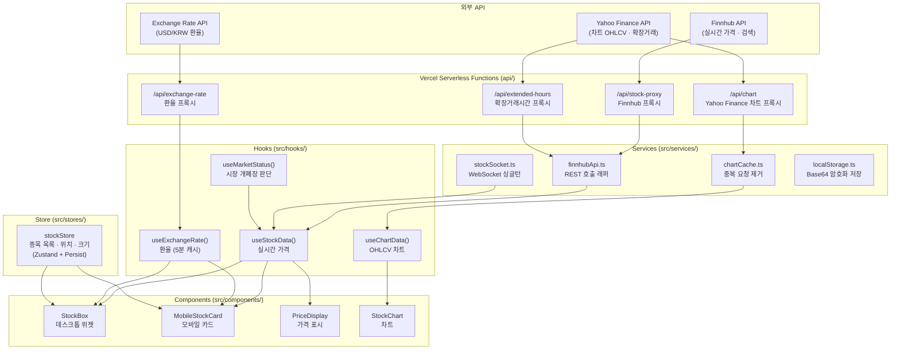
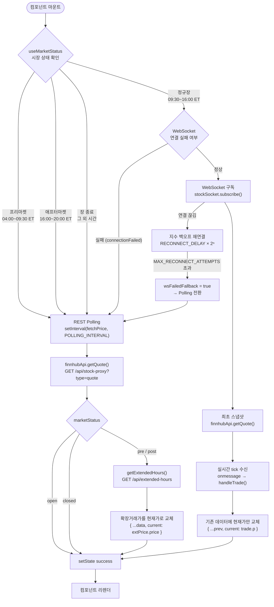
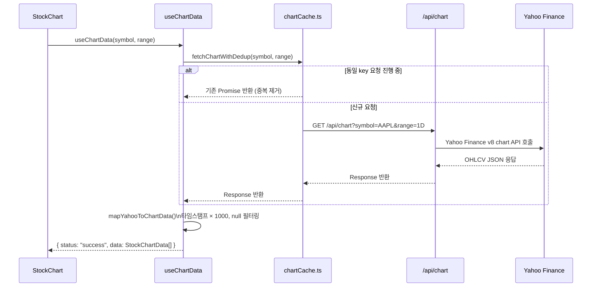
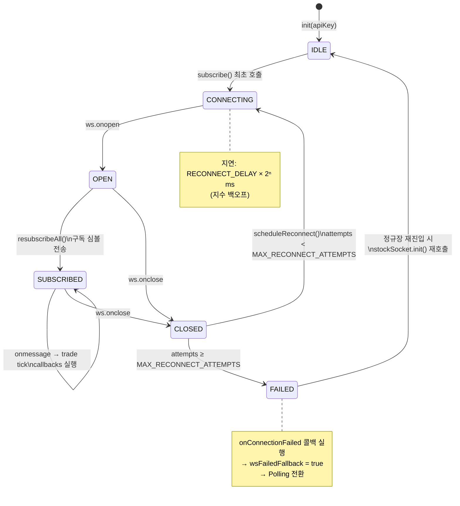
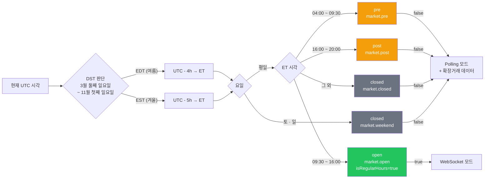
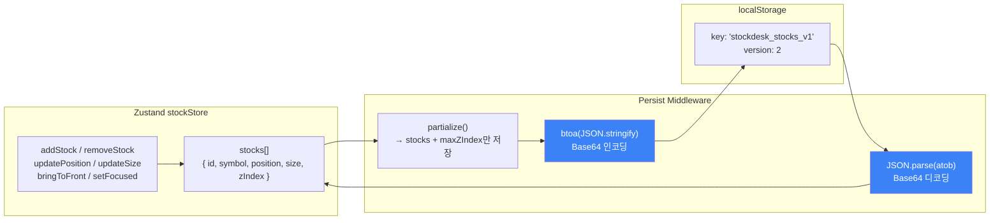
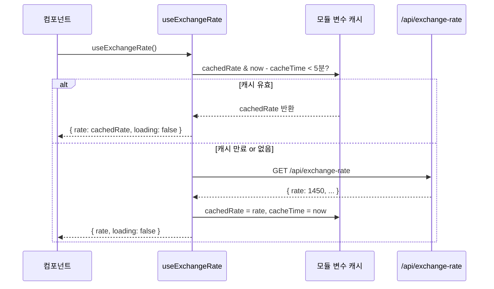

# 주식 데이터 흐름 (Data Flow)

> 실제 코드 기반으로 작성된 아키텍처 다이어그램입니다.

---

## 1. 전체 레이어 구조

---

## 2. 실시간 가격 데이터 흐름 (`useStockData`)

---

## 3. 차트 데이터 흐름 (`useChartData`)

---

## 4. WebSocket 연결 및 재연결 (`stockSocket`)

---

## 5. 시장 상태 판단 (`useMarketStatus`)

---

## 6. 상태 영속화 (`stockStore`)

---

## 7. 환율 캐싱 (`useExchangeRate`)

---

## 파일 위치 참고

| 다이어그램      | 파일                                                                                 |
| --------------- | ------------------------------------------------------------------------------------ |
| REST 래퍼       | [src/services/api/finnhubApi.ts](../../src/services/api/finnhubApi.ts)               |
| WebSocket       | [src/services/websocket/stockSocket.ts](../../src/services/websocket/stockSocket.ts) |
| 차트 캐시       | [src/services/api/chartCache.ts](../../src/services/api/chartCache.ts)               |
| 실시간 가격 훅  | [src/hooks/useStockData.ts](../../src/hooks/useStockData.ts)                         |
| 차트 데이터 훅  | [src/hooks/useChartData.ts](../../src/hooks/useChartData.ts)                         |
| 시장 상태 훅    | [src/hooks/useMarketStatus.ts](../../src/hooks/useMarketStatus.ts)                   |
| 환율 훅         | [src/hooks/useExchangeRate.ts](../../src/hooks/useExchangeRate.ts)                   |
| 상태 스토어     | [src/stores/stockStore.ts](../../src/stores/stockStore.ts)                           |
| Finnhub 프록시  | [api/stock-proxy.ts](../../api/stock-proxy.ts)                                       |
| 차트 프록시     | [api/chart.ts](../../api/chart.ts)                                                   |
| 확장거래 프록시 | [api/extended-hours.ts](../../api/extended-hours.ts)                                 |
| 환율 프록시     | [api/exchange-rate.ts](../../api/exchange-rate.ts)                                   |
